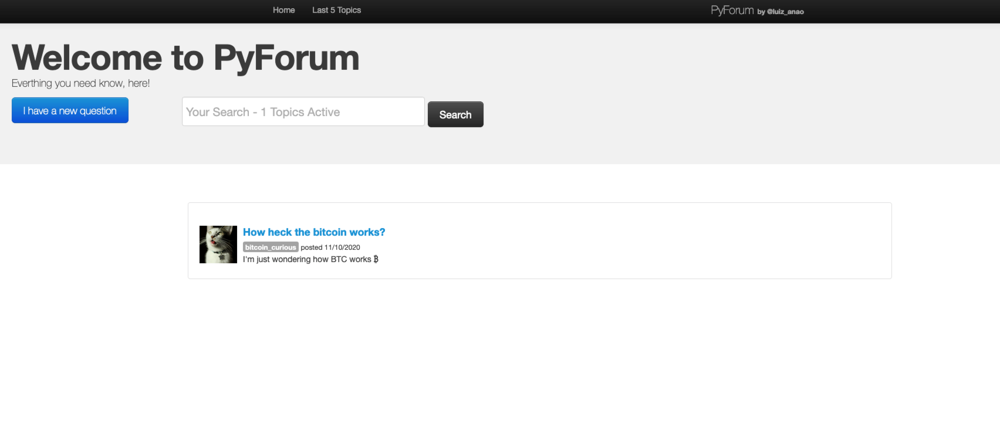

<h1 align="center">PyForum</h1>


Micro forum sample application using Pyramid, Bootstrap 3 and MongoDb.
Code produced in 2013 by a learner, so take it easy!



### How to run:

It's recommented using a virtual environment of your preference, and install the project.

```bash
python setup install
```

Get your databse up and running:

```bash
mkdir ~/data
sudo docker run -d -p 27017:27017 -v ~/data:/data/db mongo
```

and finally:

```bash
pserve development.ini
>> Starting server in PID 65819.
>> serving on http://0.0.0.0:6543
```
### Powered by:

 - Pyramid - http://docs.pylonsproject.org/en/latest/
 - Mongodb - http://www.mongodb.org/
 - Bootstrap - http://getbootstrap.com


 ### Planned but never gonna happen

 - Add up|down votes to answers
 - social-auths(github) logins
